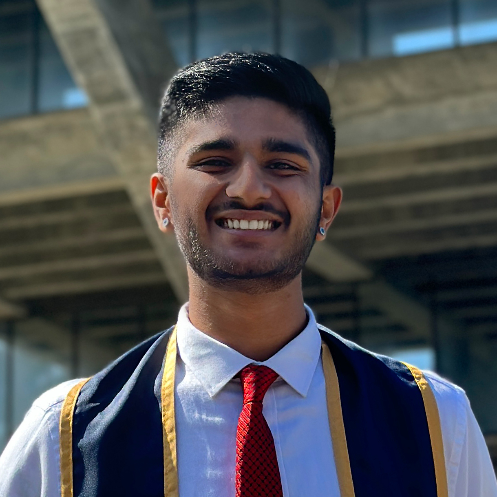

# **Hello!**

I'm **Dhruv** :wave:, 
I'm a software engineer based in Arlington, Virginia, with a deep passion for music and education. I graduated from [UC San Diego](https://ucsd.edu/) in December 2022, earning a B.S. in Mathematics-Computer Science, along with minors in Cognitive Science & Music. 

My professional journey has equipped me with 2 years of valuable experience in full-stack development and AI/ML Engineering. Currently, I am expanding my expertise in DevSecOps and am actively pursuing my [CompTIA Security+](https://www.comptia.org/certifications/security) certification. 

One of my favorite aspects of software development is the opportunity to collaborate with people from diverse backgrounds. I love learning new concepts and connecting with people across a range of industries, so feel free to [reach out to me](mailto:dhruvsood27@gmail.com) if you’d like to get in touch!




